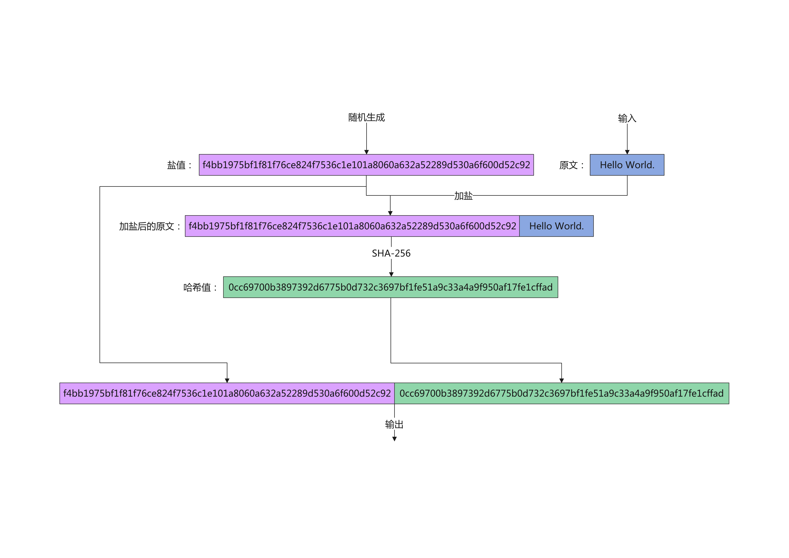

# 我的Java工具类

信息摘要工具类、AES加密工具类、RSA工具类、密码加盐

[GitHub](https://github.com/jerryt92/my_java_util)

## 密码加盐工具类

1. **什么是加盐**？ 
   
   为了避免用户的简单密码可以被轻易识别，在生成摘要时，我们可以在原文中混入一段字符串，可以是一个固定的字符串，也可以是一个随机字符串。如果是后者，则这个随机字符串也需要被存储在服务器中。

    对原文加盐可以有效地防范「彩虹表攻击」。

3. **加盐的过程**

## 关于AES-256的限制

在使用AES-256时出现

`Exception in thread "main" java.security.InvalidKeyException: Illegal key size`

Java Cryptography Extension (JCE)

~~由于美国的出口限制，JDK自带的加密算法位数都不超过256位，需要手工替换。~~

解决方式：

*Oracle官方：*

[JDK6密码扩展无限制权限策略文件](https://www.oracle.com/java/technologies/jce-6-download.html)

[JDK7密码扩展无限制权限策略文件](https://www.oracle.com/java/technologies/javase-jce7-downloads.html)

[JDK8密码扩展无限制权限策略文件](https://www.oracle.com/java/technologies/javase-jce8-downloads.html)

*我这里提供的下载：*

[JDK6](file/JcePolicy/jce_policy-6.zip)

[JDK7](file/JcePolicy/UnlimitedJCEPolicyJDK7.zip)

[JDK8](file/JcePolicy/jce_policy-8.zip)

将两个jar文件放到%JDK_HOME%\jre\lib\security 和 %JRE_HOME%\lib\security下覆盖原来文件即可

**注：最新版本的JDK似乎已经解除限制**
